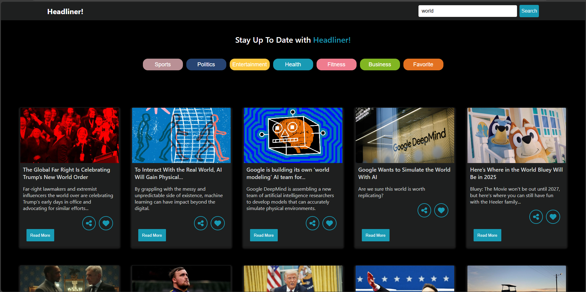
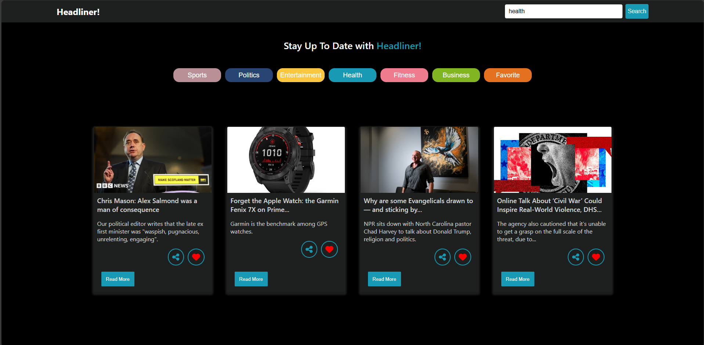

# News Application

This is a **News App** built using **React.js** and **CSS**, with **NewsAPI** integrated to fetch and display the latest news articles. The app allows users to browse articles from various categories, view article details, search for news based on keywords, and manage their favorite articles.

## Features

### User Features:
1. **Home Page:**
   - Displays a list of the latest news articles from different categories.
   - Each news card shows:
     - Article title.
     - Description.
     - News source.
     - Published date.
     - A "Read More" button that links to the full article.

2. **News Categories:**
   - Users can filter news by selecting a category, such as:
     - Business, Technology, Health, Entertainment, Sports, and more.
   - Dynamic update of articles when a category is selected.

3. **Search Functionality:**
   - Search bar for users to input keywords.
   - Fetches and displays news articles related to the entered keyword.

4. **Article Details Page:**
   - Clicking "Read More" on any article opens a detailed view showing:
     - Full article content.
     - Author (if available).
     - News source and publication date.
     - Link to the original article on the news website.

5. **Bookmark Articles:**
   - Users can bookmark articles to save them as favorites.
   - Bookmarked articles are stored in the **Favorites Tab**, accessible from the navigation bar.

6. **Share Articles:**
   - Users can share articles via:
     - **Email**: Opens a mail client with the article link pre-filled.
     - **Copy URL**: Copies the article URL to the clipboard.
     - **Social Media**: Quick sharing options for platforms like Twitter and Facebook.

7. **Responsive Design:**
   - The layout adjusts for optimal usability on mobile, tablet, and desktop devices.

8. **Error Handling:**
   - Displays error messages or fallback content if the API request fails or no results are found.

### Navigation Bar:
- **Links:**
  - Home (Displays the latest news articles).
  - Categories (Dropdown with options to filter news by category).
  - Search (Allows users to search for news articles by keyword).
  - Favorites (Displays the list of bookmarked articles).

## Technology Stack
- **Frontend:** React.js
- **Styling:** CSS (custom styling for a clean and modern look)
- **API:** NewsAPI (https://newsapi.org)

## Installation

To run this project locally, follow these steps:

1. Clone the repository:
   ```bash
   git clone https://github.com/Portia-Nelly-Mashaba/NewsApp.git
   ```

2. Install the dependencies:
   ```bash
   cd news-app
   npm install
   ```

3. Obtain an API key from [NewsAPI](https://newsapi.org).
   - Register on the website and get your free API key.

4. Create a `.env` file in the root of the project and add your API key:
   ```bash
   REACT_APP_NEWS_API_KEY=your_api_key_here
   ```

5. Start the React development server:
   ```bash
   npm start
   ```

6. Open the app in your browser:
   ```
   http://localhost:3000

   ```

## Screenshots





## Future Enhancements
- Add sorting options (e.g., sort by date or popularity).
- Enable offline access for bookmarked articles.
- Integrate additional sharing platforms for articles.
```

### Next Steps:
**a.** Would you like me to implement a specific feature, such as bookmarks or sharing, and provide the React.js code?  
**b.** Do you want suggestions for integrating social media or email sharing APIs?